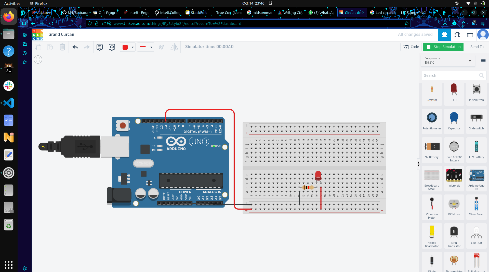

# Ponderada Computação Semana 1

## Introdução
&nbsp; Esta ponderada foi dividida em três partes principais: **Blink interno**, **simulação de Blink** e **ir além**.  
A primeira parte consistia em realizar um código simples para piscar o LED interno do Arduino.  
Na segunda, foi necessário realizar a simulação de piscar um LED no Tinkercad.  
E a terceira era um desafio para ir além, utilizando os conteúdos abordados (foi sugerido fazer mais de um LED piscar no circuito da instrução).  

Aproveitei a oportunidade de ser uma ponderada mais simples para testar alternativas ao Arduino IDE.  
Neste projeto, usei o **Arduino CLI**, que oferece um maior controle e entendimento do processo de programação embarcada.

---

## Parte 1: Blink LED Interno
&nbsp; Eu separei o conteúdo desta parte na branch `feat(blink_interno)`.  
O projeto foi dividido em três arquivos principais: `led.hpp`, `led.cpp` e `LedBlink.ino` (que funciona como a *main*).  

- No `.hpp`, eu **declaro** a classe `LED` e seus métodos `on`, `off` e `blink` (que utiliza os dois primeiros).  
- No `.cpp`, eu **implemento** esses elementos.  
- No `.ino`, eu **instancio** o objeto `LED`.

### 🎥 Vídeo demonstração
[📹 Clique aqui para assistir ou baixar o vídeo](https://drive.google.com/file/d/1IJd4EDCoFjQSIBkYzuWLf7d0Yrkp1SZY/view?usp=sharing)

---

## Parte 2: Simulação Tinkercad

---

## Parte 3: Ir Além
&nbsp; Eu separei o contúdo desta parte na branch `feat(extra_da_ponderada)`
Para realizar a parte do **ir além**, primeiro aprendi a utilizar o **LED RGB**.  

🎞️ [Vídeo LED RGB](https://drive.google.com/file/d/1VyF-uhCH1zKY_u8IZpCRiuxhQZ6V4SG7/view?usp=sharing)

Eu usei três laços `for` para varrer os valores de cada terminal de sinal do RGB (de 0 a 255), gerando as **8 combinações possíveis** entre eles.  
Depois disso, juntei esse circuito com o anterior (que possuía quatro LEDs coloridos), apenas inserindo-os dentro do `for`.

🎬 [Vídeo Resultado Final](https://drive.google.com/file/d/1wd_ClJUXihuyL6mx9v9irxkK2CaDbu9w/view?usp=sharing)
                            